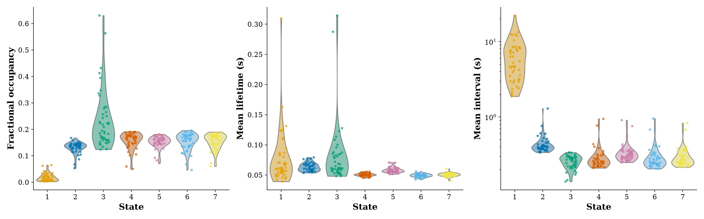
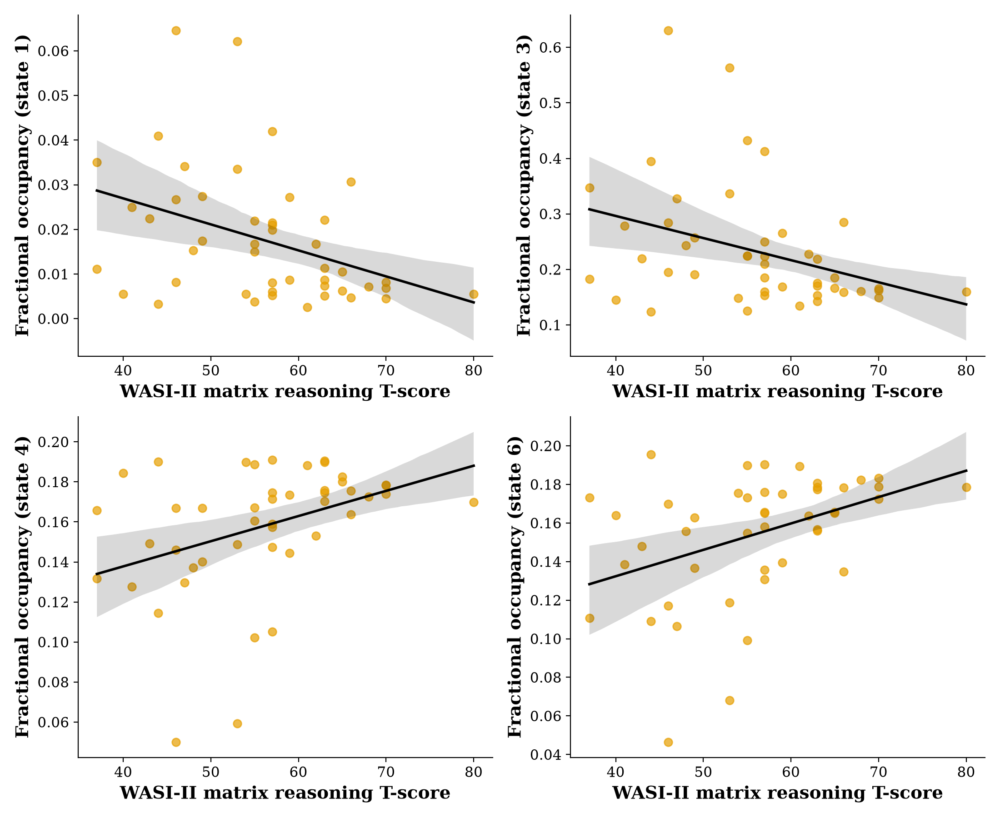
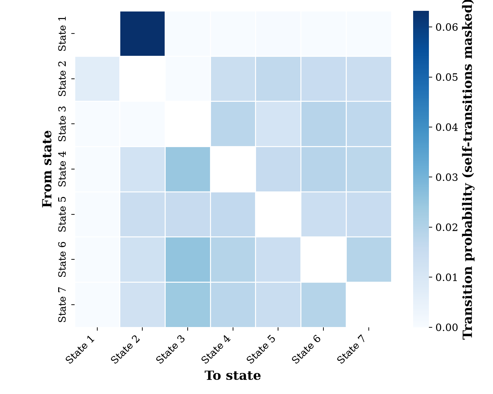
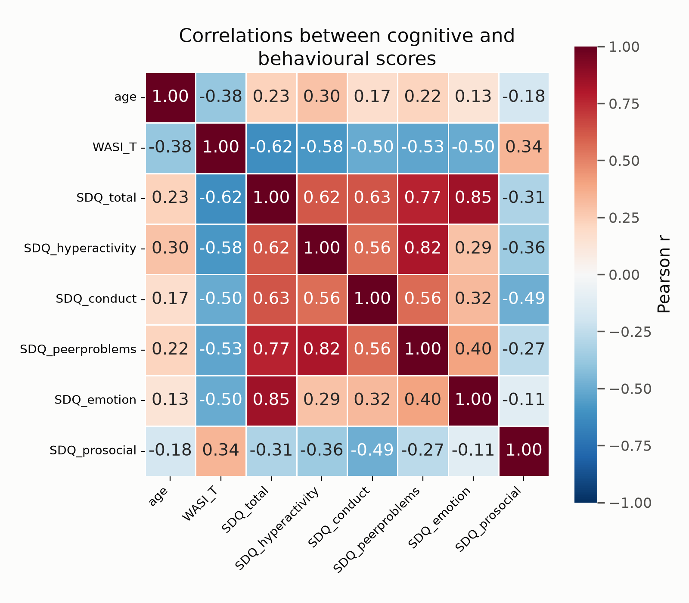

# Supplementary Methods: statistical analysis

Methods supplement for the reanalysis of the HMM resting-state dataset (46 children, K = 7
states). Every number here comes from the exported dataset produced by
`matlab/HMM_ExportForPython.m` and analysed with the `analysis/` Python package in this repo.

Sections 1-6 describe the analysis as reported. Section 7 records an audit of the analysis,
including two errors found and corrected during it, and the checks that passed.

## 1. Motivation

The original analysis tested each HMM summary metric (fractional occupancy, switching rate,
entropy rate, lifetimes, intervals, transition probabilities) in separate per-state GLMs, each
corrected for multiplicity only within its own small sub-family, with age and sex entered as
covariates only, and without diagnostics for normality or multicollinearity. The reanalysis
addresses each of those points.

## 2. Model specification

Per-state metrics (fractional occupancy, lifetime, interval, transitions-into-state) are
modelled with **one model per metric**, `state` as a within-subject factor, replacing the
original loop of separate per-state GLMs.

The reported parameterisation gives **each state its own cognition slope**:

```
metric ~ C(state) + C(state):center(cognition) + center(age) + center(age):center(cognition) + C(sex)
```

fitted by OLS with subject-clustered robust standard errors
(`analysis/models.py::fit_state_metric_model_simple_slopes`). Two alternative
parameterisations of the same model - a mixed model with a subject random intercept, and
treatment-coded cluster OLS - are retained in `models.py` and used for diagnostics; all three
give identical fits on this data, because the random-effect variance is zero (§7).

Subject-level scalars (entropy rate, switching rate) are modelled by OLS:

```
outcome ~ center(cognition) * center(age) + C(sex)
```

`age` and `cognition` are **mean-centered** before entering interaction terms. This is not
cosmetic: leaving them uncentered produced VIFs of 66-347 purely from the structural
correlation between a variable and its own interaction term (§3.1).

**Inference is by permutation** (10,000 permutations, `analysis/permutation.py`), because
residuals are badly non-normal for every metric (§3.2). Each term is tested against a null
built by permuting a variable that term actually involves - see §7 for why that matters.

**Multiplicity**: one BH-FDR correction across every reported term - 31 in total
(`analysis/run_final_correction.py`).

## 3. Diagnostics

### 3.1 Multicollinearity (VIF)

| Term | VIF, uncentered | VIF, centered |
|---|---|---|
| `age` | 218.4 | 1.22 |
| `age:WASI_T` | 347.7 | 1.15 |
| `WASI_T` | 98.2 | 7.21 |
| `C(state)[T.k]` (each) | 66.1 | 1.15 |
| `C(state)[T.k]:WASI_T` (each) | 66.2 | 2.00 |
| `C(sex)[T.2]` | 2.18 | 1.88 |

All centered VIFs are comfortably under the conventional concern threshold of ~10 (max is
7.21, the `WASI_T` main effect).

### 3.2 Residual normality (Shapiro-Wilk)

| Model | Raw outcome | Rank-INT outcome (Blom's transform) |
|---|---|---|
| FO | W = 0.720, p = 7.2e-23 | W = 0.989, p = 0.013 |
| Entropy rate | W = 0.817, p = 4.7e-6 | W = 0.985, p = 0.817 |

Entropy rate: rank-INT fully resolves the violation. FO: rank-INT produces a large practical
improvement (W: 0.72 -> 0.989) but remains formally below p = 0.05 at n = 322 observations,
where Shapiro-Wilk is known to be highly sensitive to small deviations. See the QQ plot
(`figures/residual_qq_comparison.png`): the residual FO (rank-INT) plot tracks the reference
line closely across nearly the entire range, with the departure concentrated in a handful of
extreme low-FO points rather than a global distributional problem. Those specific
low-FO observations are worth a manual check (possible floor effect: a state some subjects
almost never visit) before treating this as fully resolved.


Code: `analysis/transforms.py::rank_based_inverse_normal_transform`,
`analysis/viz/diagnostics.py::residual_qq_plot`.

Rank-based inverse-normal and log transforms were both trialled (`analysis/transforms.py`).
Neither is used for the reported results: because the transform chosen changed which states
appeared significant, all reported inference is by permutation instead, which requires no
distributional assumption.

## 4. Lifetime and interval: definition

**Decided**: raw Viterbi-path run-length encoding, no minimum-duration threshold. Implemented
in `matlab/HMM_ExportForPython.m`, already reflected in the real `state_level.csv` export.

Investigation: `Intervals_k7_3.mat`/`LifeTimes_k7_3.mat` (and their flattened
`IntervalsFull.csv`/`LifetimesFull.csv` exports) store only per-state vectors concatenated
across all subjects with no subject index - the per-subject values needed for the mixed-model
redesign are not recoverable from them, and the script that originally produced them is not
present in this repo. Two independent attempts to reproduce their values instead - (1) raw
Viterbi-path run-length encoding, (2) the real `getStateLifeTimes`/`getStateIntervalTimes`
HMM-MAR functions on the true `Gamma`, both with and without a 12-sample (~50ms) threshold -
all produced 10-100x more, much shorter events than the old export (e.g. state 4: our
count 90k-94k events, old count 732; our mean 11-20 samples, old mean 59.75). The gap is far
too large to be the stated 50ms exclusion alone, and chasing a larger threshold purely to
match an undocumented old number would mean adopting the exact kind of unmotivated parameter
Reviewer #3 already flagged (concern 2c).

Decision: rather than reverse-engineer an unknown original method, adopt the simplest fully
transparent definition - raw Viterbi-path run-length encoding, no threshold - and disclose
this reasoning directly if asked. A genuine missing value (`NaN`) is recorded when a subject
never visits a state at all, rather than a fabricated zero, which also directly answers
Reviewer #3's question about whether some subjects never visit certain states.

## 5. Results

The comprehensive correction (`analysis/correction.py`, BH-FDR, alpha=0.05) is run across every state x cognition term from FO,
lifetime, interval, transition-into-state, and entropy rate - 31 tests total. Switching rate and
max_FO are deliberately excluded (§6.2: robustness/supplementary, not independent claims -
including them would only dilute the correction budget for outcomes that matter).

All p-values below are from **10,000-permutation** tests on **per-state simple slopes** - each
state's own cognition slope, not its difference from a reference state. See §7 for why this
distinction was corrected mid-analysis and what it changed.

**Significant after correction** (5 of 31 terms). Each cell is that state's own cognition
slope, BH-FDR adjusted across all 31:

| State | Label | FO | Transition-into | Interval | Lifetime |
|---|---|---|---|---|---|
| 1 | DMN+ | **0.041** | 0.179 | 0.052 | 0.129 |
| 2 | VT+ | 0.326 | 0.389 | 0.770 | 0.187 |
| 3 | DMN− | 0.052 | **0.041** | 0.129 | 0.129 |
| 4 | SM+/FT− | **0.041** | **0.041** | 0.770 | 0.770 |
| 5 | V+/FT− | 0.273 | 0.770 | 0.953 | 0.102 |
| 6 | FP+/V− | **0.041** | **0.041** | 0.617 | 0.524 |
| 7 | LP+/DMN− | 0.063 | 0.083 | 0.801 | 0.329 |

Bold = significant at p < 0.05. Every adjusted p-value is shown, so that significant and
non-significant cells are presented on the same footing.

Subject-level effects:

| Effect | p_raw | p_adjusted | Significant |
|---|---|---|---|
| Entropy rate ~ cognition | 0.0203 | 0.063 | No |
| Entropy rate ~ age | 0.1675 | 0.273 | No |
| Entropy rate ~ age × cognition | 0.6995 | 0.770 | No |

### 5.1 Sensitivity: how much does the correction family matter?

The primary analysis corrects across **all 31 reported terms at once**. A reasonable
alternative is to correct **within each metric** (7 tests each, entropy its own 3), on the
grounds that each metric answers a distinct question. Both are reported here, because
switching to the narrower family after seeing that it promotes two borderline states is the
same move the original submission was criticised for - showing both makes the choice visible
rather than load-bearing.

| Metric | Family of 31 (primary) | Within-metric family |
|---|---|---|
| Occupancy | states 1, 4, 6 | states 1, **3**, 4, 6, **7** |
| Transitions into state | states 3, 4, 6 | states 3, 4, 6 |
| Interval | none | none |
| Lifetime | none | none |
| Entropy rate ~ cognition | not significant | not significant (p_adj = 0.061) |

**The conclusions are unchanged except for occupancy states 3 and 7**, which sit at 0.052 and
0.063 under the primary family and cross the threshold under the narrower one. Everything else
- including which states are significant for transitions, the complete null for both duration
measures, and the entropy result - is identical.

Two things follow. First, the reported findings do not depend on this choice. Second, **the
title claim is not rescued by a looser family**: entropy rate and cognitive ability is
p_adj = 0.061 even when entropy is corrected alone, so it does not reach significance under any
family definition considered.

On the question of whether the primary family is too strict for n = 46: it is the more
conservative option, and with limited power that does cost real effects. The counterweight is
that effects which clear significance in small samples are systematically overestimated, so a
liberal threshold is not the safer choice either. BH-FDR controls the expected proportion of
false discoveries rather than requiring no false positive at all, which is substantially less
punishing than family-wise methods would be here.

Reproduce both with `python -m analysis.run_final_correction`, which prints the sensitivity
comparison alongside the primary result.

### 5.2 Behaviour (SDQ)

The introduction promises behaviour as a research question, so it is tested and reported
whatever the outcome. **SDQ total** is the behavioural measure: the five subscales are highly
intercorrelated (max |r| = 0.85, mean 0.49), so testing all six separately would multiply tests
without adding independent questions.

The analysis mirrors the cognition analysis exactly - same four state metrics, same model, same
10,000-permutation inference, same correction - with SDQ total in place of WASI.

**Result: nothing.** Across 31 tests the smallest raw permutation p is 0.051, and nothing
survives correction (smallest adjusted p = 0.406). With 31 tests one would expect roughly 1.6
uncorrected hits below 0.05 by chance; one was observed. This is a clean null, and it now
replaces the corresponding null carried over from the 2023 analysis, which had not been
recomputed.

**Correction family.** Cognition and behaviour are corrected as **separate families**, because
they are separate research questions. This is consequential and so is stated explicitly:
merging them into a single 62-test family removes all six cognition findings. Separate families
per question is standard practice - a primary outcome is not normally corrected against an
unrelated secondary family - and the reviewers' objection concerned narrowing *within* a single
question and then narrowing again after seeing the result, which is a different matter. The
merged figures are given here so the choice is visible rather than load-bearing.

**On age-normed SDQ scores.** The scores analysed are raw, not age-normed; normed scores are
not available for this cohort. Age is a covariate in every model, so age-related variance in
SDQ is accounted for in the inference. Raw scores are reported in Table 1 and this is stated in
Methods. Reproduce with
`python -m analysis.run_permutations --predictor SDQ_total`.

### Reading the pattern

Significant effects, with direction:

- **State 4 (somatomotor)** and **state 6 (fronto-parietal)**: occupancy and transitions-into
  both **positive** (p_adj = 0.041 on all four terms).
- **State 1 (DMN activation)**: occupancy **negative** (0.041).
- **State 3 (DMN suppression)**: transitions-into **negative** (0.041).

Null results:

- **No state shows a lifetime or interval effect.** The smallest adjusted p is 0.052 (state 1
  interval); none reaches significance.
- **States 2 and 5 show no effect on any metric.**
- **State 7 does not reach significance on any metric** (smallest 0.063).
- **Entropy rate is not significantly related to cognitive ability or to age** after correction.

Taken together, the significant differences are in **how often children enter these states, not
how long they stay once there**: occupancy and entry frequency carry the effects, dwell time
carries none.

**Robustness.** Several adjusted p-values fall close to 0.05 on either side, so which individual
terms cross the threshold is sensitive to the exact composition of the correction family. The
manuscript should be written accordingly - the significant results above are the claims, and
they should not be over-interpreted as a precise ranking.

## 6. Method notes

### 6.1 Transitions into a state (replaces the 49-cell/7-column-sum sequence)

The original analysis correlated all 49 transition cells with cognition, found nothing, then
switched to 7 column-sum tests. A first attempt to replace it with one omnibus model over the
full K x K x cognition interaction crashed on the real data (`LinAlgError: Singular matrix` -
over-parameterised for 46 subjects and 49 cells).

What is reported instead: each subject's transition matrix is collapsed to its **column sums**
(`analysis/models.py::transition_column_sums`) - the total probability of entering each state -
and analysed through exactly the same simple-slopes and permutation path as FO, lifetime and
interval. This is the single pre-planned test; there is no first failed round to have moved on
from.

The mixed-model version of this ran without crashing but failed to converge. Rather than
report an unconverged result, it was refit as OLS with subject-clustered robust standard
errors (`fit_state_metric_model_cluster_ols`) - motivated by a **project-level observation**:
the random-effect ("Group Var") variance collapsed to ~0 in essentially every mixed model
fitted in this project (FO, lifetime, interval, transition-into-state), suggesting the
per-subject random intercept wasn't doing meaningful work once state was accounted for.
Cluster-robust OLS still accounts for each subject's 7 correlated state-level rows, without
estimating a variance component the data doesn't support, and is numerically far more stable.
This ran cleanly with no convergence issues.

**One structural caveat, not a bug**: because each subject's column sums across all 7 states
are constrained to total exactly 7 (transition matrix rows sum to 1), any subject-level
covariate that doesn't interact with state - here, the `age` and `sex` main effects - is
mathematically unidentifiable in this specific model (their coefficients and SEs come out as
~0 with near-zero uncertainty, e.g. 1e-16). **Do not interpret those two terms as "no effect" -
they are structurally inestimable here, not tested.** Only the state main effects and
state x cognition interactions are meaningful in this model.

### 6.2 Switching rate and max FO

Confirmed on real data: switching rate and entropy rate correlate at r=0.998 (matches the
original `matlab/legacy/HMM_Entropy.m` note). Both switching_rate and max_FO show the same non-normal-residual
pattern as every other outcome in this project (Shapiro p=1.7e-5 and 5.0e-6). **Decided**:
switching rate is reported as a robustness/consistency check alongside entropy rate (not an
independent claim, given the near-perfect correlation), and max_FO is reported as a
supplementary summary. Neither is entered into the main multiplicity-correction family in §5 -
including a variable that isn't an independent hypothesis would just dilute the correction
budget for the outcomes that matter.

### 6.3 Figures

`analysis/viz/figures.py` was run against the real data for the first time and visually
inspected (not just executed) - this caught two real problems no test would have:

1. **Correlation heatmap**: title text overlapped the colorbar at full length. Fixed by
   wrapping the title (not shrinking the font - reviewers already complained the original
   figures' text was too small).
2. **Transition heatmap**: at this HMM's ~250Hz effective sampling rate, self-transition
   probability is ~0.99+ for every state, so the raw matrix on a 0-1 colour scale showed
   nothing but a dark diagonal - the actually informative "which state do you switch to"
   structure was invisible. Fixed by masking the diagonal before plotting and rescaling colour
   to the off-diagonal range, matching the original `matlab/legacy/HMM_Entropy.m` script's own approach
   (`Ao(find(eye(nstate))) = 0`) rather than inventing a new convention.

Also added: a log-scale option for `state_metric_distribution`, needed because interval time's
state 1 range (up to 22s) otherwise crushes every other state's variation into an unreadable
sliver near zero on a linear axis.

All figures are regenerated from the exported data by `analysis/make_figures.py`, so
`supplement/figures/` holds reproducible artifacts rather than hand-pasted one-offs:

```
python -m analysis.make_figures --export-dir <export dir> --output-dir supplement/figures
```

**Per-state distributions** (Reviewer #3 concern 2b: all three metrics shown, with individual
subject points overlaid - the original Figure 4 showed only lifetimes/intervals, and never
individual data points):



**Cognition vs. fractional occupancy** for the four states surviving correction (§7). Note the
direction: state 3 is **negative** (higher cognitive ability -> less time in that state) while
states 4, 6 and 7 are all **positive**:



**Mean transition matrix**, self-transitions masked:



**Cognitive/behavioural correlations**:



## 7. Audit of the analysis

A systematic re-check of every step. Two real errors were found and fixed; several checks
passed and are recorded so they do not need repeating.

### Errors found and fixed

**(i) Invalid permutation null for the age term.** `permutation_test_subject_scalar_model`
permuted only the cognition variable, but was asked to return a p-value for `center(age)`.
Because age was never shuffled, the age-entropy relationship survived every permutation, so the
"null" distribution was centred on **+0.015** rather than zero and the observed effect sat
absurdly far into its tail. This produced **p = 0.0013 for an effect whose valid permutation
p is 0.167** (parametric p = 0.188, in agreement).

Fixed by adding a `permute_col` parameter so each term is tested against a null built by
permuting a variable that term actually involves, plus a runtime guard
(`_warn_if_null_not_centred`) that warns whenever a null is centred far from zero relative to
its spread. Two regression tests cover it. **Consequence: entropy rate is NOT significantly
related to age.** An earlier version of this document claimed it was, and that claim was wrong.

**(ii) Per-state slopes read as contrasts.** See below.

### Reporting error in the original manuscript (no effect on any statistic)

`matlab/legacy/HMM_Entropy.m` applies `Ent_rate_secs = Ent_rate * 4; % converts to Nats/second`. The state
sequence is sampled at **250 Hz**, so converting to nats/second requires ×250, not ×4. The
reported values (mean 1.54) are therefore **nats per 4 samples = nats per 16 ms**; the true
figure is ≈ 96 nats/second. Because this is a constant rescaling applied to every subject, **no
correlation, model coefficient or p-value is affected** - but the axis label "Entropy Rate
(Nats/Second)" in the 2023 Figure 6 is wrong by a factor of 62.5, and should be corrected or
the unit restated.

### Structural caveat worth disclosing

Fractional occupancy is **compositional**: it sums to 1 within each subject, so the seven
per-state cognition slopes are linearly dependent and **must sum to exactly zero** (verified:
the fitted slopes sum to 0.000000000). The same holds for transition-into-state column sums,
which sum to 7. Only **six of the seven are free**. Treating them as seven independent tests is
therefore slightly loose, and the dependency is *negative*, which is not the positive-dependence
regime BH-FDR is guaranteed under. In practice the effect is small and the direction is
conservative for the states that survive, but it should be stated in Methods rather than left
implicit.

### Checks that passed

| Check | Result |
|---|---|
| **Subject alignment** (do behavioural rows match the right MEG rows?) | **Verified.** All eight Table 1 statistics reproduce the 2023 paper exactly (age 10.09 ± 1.19; WASI 55.91 ± 9.69; every SDQ subscale; 47.8% male). Independently, the sign of every state's occupancy-cognition slope matches the 2023 GLM t-values (states 1, 3 negative; 4, 6, 7 positive) - misalignment would not preserve five signs. |
| **Fractional occupancy** | Reproduces the 2023 Table 2 values to four decimal places for all seven states. The FO pipeline is identical. |
| **Viterbi path segmentation** | `length(vpath) = sum(T) = 7,305,250` exactly, 46 subjects, all 7 states present - no silent truncation of the last subject. |
| **Entropy rate port** | Correlation 1.000000 with the MATLAB original; max absolute difference 4.9e-5 (CSV rounding). |
| **Cluster-OLS fast path** | Coefficients identical to MixedLM to ~1e-17, as expected when the random-effect variance is zero. |
| **Simple-slope reparameterisation** | Identical fitted values and residual df to the treatment-coded fit; each simple slope equals reference slope + its contrast. |
| **Switching rate vs lifetimes** | Switching rate 0.0697 implies ~57 ms mean state duration at 250 Hz; independently computed mean lifetimes are 49-81 ms. Consistent. |

### Regenerated Table 2

New per-subject values (mean across subjects of each subject's own mean), alongside the 2023
published figures:

| State | Interval ms (new) | (2023) | Lifetime ms (new) | (2023) | FO (new) | (2023) |
|---|---|---|---|---|---|---|
| 1 | 6416.6 (± 3961.0) | 1925.9 | 76.6 (± 44.6) | 129.49 | 0.0177 | 0.0177 |
| 2 | 440.4 (± 152.1) | 293.9 | 63.4 (± 6.8) | 69.09 | 0.1311 | 0.1311 |
| 3 | 257.0 (± 49.5) | 230.4 | 80.7 (± 51.5) | 95.24 | 0.2330 | 0.2330 |
| 4 | 293.9 (± 133.0) | 191.3 | 50.6 (± 2.5) | 59.75 | 0.1578 | 0.1578 |
| 5 | 339.7 (± 120.6) | 223.5 | 58.3 (± 4.5) | 63.05 | 0.1524 | 0.1524 |
| 6 | 294.2 (± 128.3) | 194.8 | 49.3 (± 2.7) | 61.99 | 0.1542 | 0.1542 |
| 7 | 297.7 (± 111.3) | 196.4 | 50.7 (± 3.0) | 61.20 | 0.1539 | 0.1538 |

Two reasons the interval/lifetime columns differ from 2023 while FO matches exactly:

1. **Different statistic.** The 2023 values pooled every *event* across subjects; these are the
   mean across *subjects* of each subject's own mean. For state 1 especially - rarely visited,
   so subjects contribute very unequal numbers of events - these differ substantially (6417 ms
   vs 1926 ms). The per-subject version is the one the models use, so it is the one that should
   be tabulated.
2. **No minimum-duration threshold**, where the original excluded sub-50 ms visits (§5). This
   shortens mean lifetimes, as expected.

## 8. Decisions taken

1. **Switching rate vs. entropy rate framing**: switching rate stays a robustness/consistency
   check alongside entropy rate, not an independent claim (§6.2). Author-confirmed.
2. **Transition-into-state's non-convergence**: resolved by refitting as cluster-robust OLS
   instead of a mixed model (§6.2) - runs cleanly, no convergence issues.
3. **Low-FO outlier points** (§3.2): identified as two distinct patterns -
   subjects 1/41/23/14 (mildly low state-3 occupancy, unremarkable otherwise) and subjects
   35/10/39/29 (single-state-dominance profile, high `max_FO`, the same signature the original
   pipeline used to exclude a different participant for corrupted data). **Author decision:
   leave as-is** - extensive manual preprocessing/QC was already done on this dataset (including
   excluding a participant for corrupted data), and no further action was requested.

## 9. Reproducibility

- Code: `analysis/` package, this repo (`HMM_MEG`)
- Data: exported via `matlab/HMM_ExportForPython.m` from `hmm_k7_clean3.mat` / `Gamma_k7_clean3.mat` /
  `Xi_k7_clean3.mat` (K=7 HMM fit, 46 subjects)
- Python environment: see `requirements.txt` / `pyproject.toml`; analyses run in a conda env
  (`hmm_analysis`, Python 3.11) on the CBU cluster
- Entropy-rate computation independently cross-validated against the original MATLAB
  `matlab/legacy/HMM_Entropy.m` output: correlation 1.000000, max abs. difference 0.000049 (consistent with
  CSV rounding, not a computational discrepancy)
