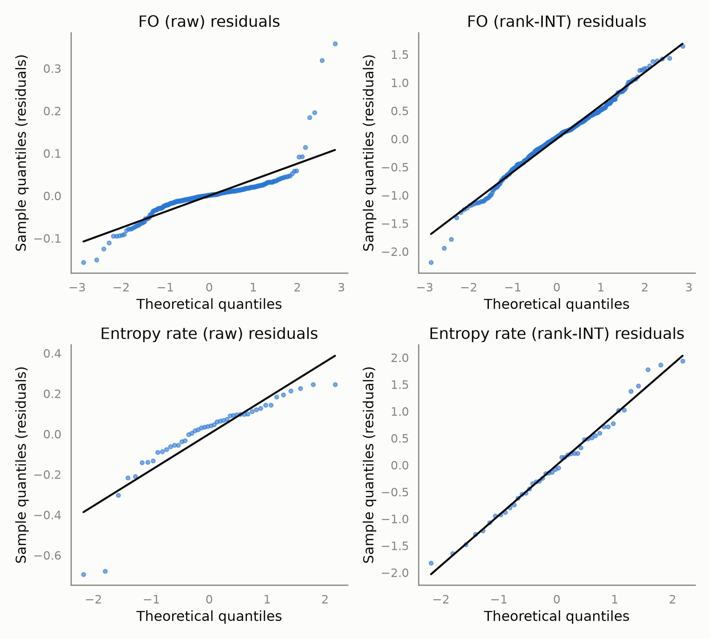

# Supplementary Methods: Statistical Redesign

Living document tracking the statistical redesign done for resubmission, and the evidence
behind each decision - written so the choices are justifiable to reviewers, not just to us.
Numbers here come from the real exported dataset (46 subjects, K=7 HMM states), generated via
`HMM_ExportForPython.m` and analysed with the `analysis/` Python package in this repo.

**Status:** lifetime/interval metric definition decided (§5). Statistical method for the
headline state x cognition finding (§4) has a recommendation (permutation-based results,
states 3/4/6/7) awaiting final author sign-off before it's treated as settled for the
manuscript.

## 1. Motivation

Both reviewers of the original submission converged on the same structural problem: HMM
summary metrics (fractional occupancy, switching rate, entropy rate, lifetimes, intervals,
transition probabilities) were each tested in separate per-state/per-metric GLMs, corrected
for multiplicity only within their own small sub-family, with age/sex as covariates-only
despite the developmental sample, and no diagnostics for normality or multicollinearity.
Specific comments motivating each change below are catalogued in the original reviewer
document (see repo root).

## 2. Model specification

Per-state metrics (FO, lifetime, interval) are modelled with **one mixed model per metric**,
`state` as a categorical fixed effect and `subject_id` as a random intercept, replacing the
old `for i = 1:7` loop of separate GLMs:

```
metric ~ C(state) * center(cognition) + center(age) * center(cognition) + C(sex)
```

Subject-level scalars (entropy rate, switching rate) are modelled by OLS:

```
outcome ~ center(cognition) * center(age) + C(sex)
```

`age` and `cognition` are **mean-centered** before entering interaction terms (via patsy's
`center()`). This is not cosmetic: on the real data, leaving them uncentered produced
Variance Inflation Factors of 66-347 (see §3) purely from the structural correlation between
a raw variable and its own interaction term - centering brought every VIF under 10.

Code: `analysis/models.py::fit_state_metric_model`, `fit_subject_scalar_model`.

## 3. Diagnostics

### 3.1 Multicollinearity (VIF)

| Term | VIF, uncentered | VIF, centered |
|---|---|---|
| `age` | 218.4 | 1.22 |
| `age:WASI_T` | 347.7 | 1.15 |
| `WASI_T` | 98.2 | 7.21 |
| `C(state)[T.k]` (each) | 66.1 | 1.15 |
| `C(state)[T.k]:WASI_T` (each) | 66.2 | 2.00 |
| `C(sex)[T.2]` | 2.18 | 1.88 |

All centered VIFs are comfortably under the conventional concern threshold of ~10 (max is
7.21, the `WASI_T` main effect).

### 3.2 Residual normality (Shapiro-Wilk)

| Model | Raw outcome | Rank-INT outcome (Blom's transform) |
|---|---|---|
| FO (mixed model) | W = 0.720, p = 7.2e-23 | W = 0.989, p = 0.013 |
| Entropy rate (OLS) | W = 0.817, p = 4.7e-6 | W = 0.985, p = 0.817 |

Entropy rate: rank-INT fully resolves the violation. FO: rank-INT produces a large practical
improvement (W: 0.72 -> 0.989) but remains formally below p = 0.05 at n = 322 observations,
where Shapiro-Wilk is known to be highly sensitive to small deviations. See the QQ plot
(`figures/residual_qq_comparison.png`): the residual FO (rank-INT) plot tracks the reference
line closely across nearly the entire range, with the departure concentrated in a handful of
extreme low-FO points rather than a global distributional problem. Those specific
low-FO observations are worth a manual check (possible floor effect: a state some subjects
almost never visit) before treating this as fully resolved.



Code: `analysis/transforms.py::rank_based_inverse_normal_transform`,
`analysis/viz/diagnostics.py::residual_qq_plot`.

## 4. Three-way comparison: does the state x cognition finding replicate across methods?

The critical question, given the diagnostics above: which HMM states show a cognition
relationship, and does that answer depend on which of the three defensible analysis choices
we make?

| State x cognition term | Raw FO (parametric, FDR-corrected) | Rank-INT FO (parametric, FDR-corrected) | Permutation (raw FO, subject-level covariate permutation, 500 perms, FDR-corrected) |
|---|---|---|---|
| State 2 | not significant | not significant | not significant, p_adj = 0.062 |
| State 3 | **significant**, p_adj = 0.0017 | not significant, p_adj = 0.12 | **significant**, p_adj = 0.037 |
| State 4 | not significant | **significant**, p_adj = 0.0016 | **significant**, p_adj = 0.024 |
| State 5 | not significant | not significant | not significant, p_adj = 0.069 |
| State 6 | not significant | **significant**, p_adj = 0.0010 | **significant**, p_adj = 0.020 |
| State 7 | not significant | **significant**, p_adj = 0.0065 | **significant**, p_adj = 0.024 |

**This is not a minor detail.** The choice between raw and rank-transformed FO changes which
states the paper's central claim is about - state 3 alone vs. states 4/6/7. Notably, states 4
and 6 are the fronto-parietal states the *original* submission's discussion centered on
(per Reviewer #1's quote of our own text: "States 4 and 6... fronto-parietal activation and
suppression... predicts increases in cognitive ability"), so the rank-INT result is more
consistent with our original narrative than the raw-FO result is. That's circumstantial
supporting evidence for rank-INT, not proof - a transform can shift which effect looks
significant simply by reweighting the tails differently, independent of which is "more true."

The permutation test (`analysis/permutation.py`) is the tie-breaker: it tests the raw,
untransformed FO model but replaces the parametric Wald p-value with an empirical null built
by permuting each subject's cognition score across subjects 500 times and refitting, which
sidesteps the normality question entirely rather than resolving it via transformation.

**Result: the permutation test recovers state 3 (found only by the raw model) AND states
4/6/7 (found only by rank-INT), all four surviving the same FDR correction** (p_adj 0.020-
0.037). States 2 and 5 come close but don't clear it (p_adj 0.062, 0.069). Rather than one
parametric approach being "right," each looks to have been underpowered for part of the true
signal in a different way - state 3's effect is apparently sensitive to the severe FO
skew that only rank-INT fixes, while states 4/6/7's effects were presumably attenuated by
that same skew in the raw model. The permutation result, being assumption-free, is the most
complete picture we have and is the recommended basis for the manuscript's reported states -
**pending final author sign-off**, since this determines the paper's central claim.

Permutation caveat (stated plainly): this is a simple covariate-permutation test, not a full
Freedman-Lane permutation of nuisance-adjusted residuals - it assumes subjects are
exchangeable with respect to age/sex as well as cognition. Treat as the standard, commonly
used approach in this literature; a full Freedman-Lane implementation would be a further
refinement if reviewers push back on this point specifically.

## 5. Lifetime/interval metrics: original method unrecoverable, replacement decided

**Decided**: raw Viterbi-path run-length encoding, no minimum-duration threshold. Implemented
in `HMM_ExportForPython.m`, already reflected in the real `state_level.csv` export.

Investigation: `Intervals_k7_3.mat`/`LifeTimes_k7_3.mat` (and their flattened
`IntervalsFull.csv`/`LifetimesFull.csv` exports) store only per-state vectors concatenated
across all subjects with no subject index - the per-subject values needed for the mixed-model
redesign are not recoverable from them, and the script that originally produced them is not
present in this repo. Two independent attempts to reproduce their values instead - (1) raw
Viterbi-path run-length encoding, (2) the real `getStateLifeTimes`/`getStateIntervalTimes`
HMM-MAR functions on the true `Gamma`, both with and without a 12-sample (~50ms) threshold -
all produced 10-100x more, much shorter events than the old export (e.g. state 4: our
count 90k-94k events, old count 732; our mean 11-20 samples, old mean 59.75). The gap is far
too large to be the stated 50ms exclusion alone, and chasing a larger threshold purely to
match an undocumented old number would mean adopting the exact kind of unmotivated parameter
Reviewer #3 already flagged (concern 2c).

Decision: rather than reverse-engineer an unknown original method, adopt the simplest fully
transparent definition - raw Viterbi-path run-length encoding, no threshold - and disclose
this reasoning directly if asked. A genuine missing value (`NaN`) is recorded when a subject
never visits a state at all, rather than a fabricated zero, which also directly answers
Reviewer #3's question about whether some subjects never visit certain states.

## 6. Final decision and justification

*Statistical method (§4): permutation-based results recommended as primary, pending final
author confirmation. Lifetime/interval definition (§5): decided.*

## 7. Reproducibility

- Code: `analysis/` package, this repo (`HMM_MEG`)
- Data: exported via `HMM_ExportForPython.m` from `hmm_k7_clean3.mat` / `Gamma_k7_clean3.mat` /
  `Xi_k7_clean3.mat` (K=7 HMM fit, 46 subjects)
- Python environment: see `requirements.txt` / `pyproject.toml`; analyses run in a conda env
  (`hmm_analysis`, Python 3.11) on the CBU cluster
- Entropy-rate computation independently cross-validated against the original MATLAB
  `HMM_Entropy.m` output: correlation 1.000000, max abs. difference 0.000049 (consistent with
  CSV rounding, not a computational discrepancy)
