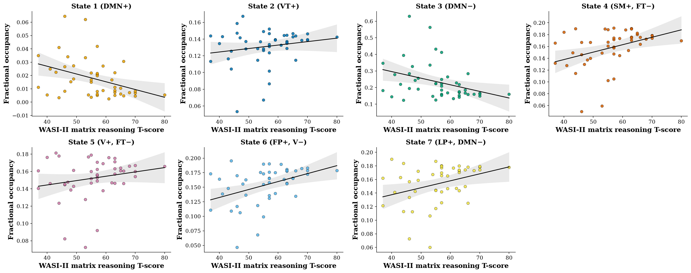
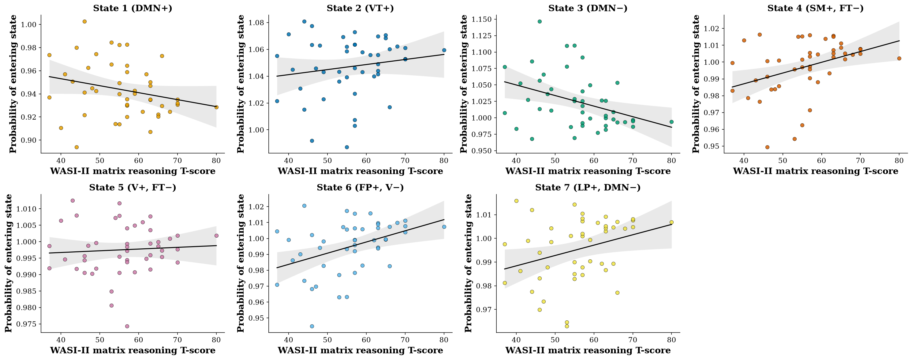

# Supplementary Materials

**Neural dynamics predict cognitive differences in development**

These materials give the full specification of the statistical models reported in section 4.2 of
the main text, the diagnostics supporting them, the complete set of uncorrected and adjusted
*p*-values for every test in both correction families, a sensitivity analysis over the choice of
correction family, and supplementary figures showing all seven states for each state-level
measure.

---

## S1. Model specification

Per-state measures (fractional occupancy, lifetime, interval, and transitions into state) are
modelled with one model per measure, with state entered as a within-participant factor. The
reported parameterisation gives each state its own cognition slope:

```
metric ~ C(state) + C(state):center(cognition)
         + center(age) + center(age):center(cognition) + C(sex)
```

where `center()` denotes mean-centring and `C()` denotes categorical coding. Under conventional
treatment coding the interaction terms would estimate each state's difference from an arbitrarily
designated reference state; the parameterisation above instead yields each state's own slope,
which is the quantity of interest. The two parameterisations are algebraically equivalent, and we
verified that they produce identical fitted values and residual degrees of freedom, with each
simple slope equal to the reference slope plus its corresponding contrast.

Models are fitted by ordinary least squares with participant-clustered robust standard errors,
which accommodates the seven non-independent observations contributed by each participant. We
also fitted each model as a mixed model with a participant random intercept. The estimated
random-effect variance was zero for every per-state measure, and the two approaches consequently
agreed to within 10<sup>-17</sup> on every coefficient; we report the cluster-robust fit.

Subject-level scalars (entropy rate, switching rate) are modelled by ordinary least squares:

```
outcome ~ center(cognition) * center(age) + C(sex)
```

Age and cognitive ability are mean-centred before entering any interaction. This is not
cosmetic; section S2.1 quantifies the effect on collinearity.

Inference is by permutation, with 10,000 permutations per term. Each term is tested against a
null distribution constructed by permuting a variable that the term itself involves, so that the
relationship under test is genuinely broken under the null. Participant labels are permuted as
whole units, which preserves the within-participant dependence across the seven states. The
two-sided *p*-value is the proportion of permuted coefficients at least as extreme in magnitude
as the observed coefficient.

Multiplicity is controlled by a single Benjamini-Hochberg correction across all 31 reported
terms: the per-state cognition slope for each of the four per-state measures across seven states,
giving 28 terms, together with the cognition main effect, the age main effect and the
age-by-cognition interaction from the entropy rate model.

## S2. Diagnostics

### S2.1 Multicollinearity

Variance inflation factors were computed for every fixed effect, both with and without
mean-centring of age and cognitive ability.

| Term | VIF, uncentred | VIF, centred |
|---|---|---|
| age | 218.4 | 1.22 |
| age × cognitive ability | 347.7 | 1.15 |
| cognitive ability | 98.2 | 7.21 |
| C(state)[k], each | 66.1 | 1.15 |
| C(state)[k] × cognitive ability, each | 66.2 | 2.00 |
| C(sex) | 2.18 | 1.88 |

Without centring, variance inflation factors reach 348, which arises from the structural
correlation between a variable and the product term containing it rather than from any
relationship among the predictors themselves. With centring, all values fall below the
conventional threshold of 10, the largest being 7.21 for the cognitive ability main effect.

### S2.2 Residual normality

| Model | Raw outcome | Rank-based inverse-normal outcome |
|---|---|---|
| Fractional occupancy | *W* = 0.720, *p* = 7.2 × 10<sup>-23</sup> | *W* = 0.989, *p* = 0.013 |
| Entropy rate | *W* = 0.817, *p* = 4.7 × 10<sup>-6</sup> | *W* = 0.985, *p* = 0.817 |

Residuals depart substantially from normality for every outcome modelled. A rank-based
inverse-normal transform (Blom's transform) fully resolves the violation for entropy rate and
produces a large improvement for fractional occupancy, though the latter remains formally below
0.05 at *n* = 322 observations, where the Shapiro-Wilk test is highly sensitive to small
departures. Figure S3 shows the corresponding quantile-quantile plots; the transformed
fractional occupancy residuals track the reference line across nearly the entire range, with the
departure concentrated in a small number of extreme low-occupancy observations.

Both a logarithmic and a rank-based inverse-normal transform were trialled. Neither is used for
the reported results: the choice of transform altered which states attained significance, and we
regard a result contingent on that choice as uninterpretable. All reported inference is
therefore by permutation, which requires no distributional assumption.

## S3. Definition of state lifetime and interval

State lifetimes and intervals are computed by run-length encoding each participant's Viterbi
path, with no minimum-duration threshold applied. A state lifetime is the duration of one
contiguous run of that state; a state interval is the gap between the end of one run and the
start of the next. Each participant contributes the mean of their own lifetimes and the mean of
their own intervals for each state, and the values tabulated in the main text are the means of
those per-participant values across participants.

Two properties of this definition are worth making explicit. First, imposing no minimum-duration
threshold means that no free parameter enters the definition, at the cost of retaining very
short visits that a threshold would discard; mean lifetimes are correspondingly shorter than
they would be under any thresholded definition. Second, where a participant never enters a given
state, a genuine missing value is recorded rather than a zero. In this sample every participant
entered every state at least once, so no state characteristic reported in the main text rests on
an imputed value.

## S4. Full results

### S4.1 State-level tests, cognitive ability

Uncorrected permutation *p*-values with Benjamini-Hochberg adjusted values in parentheses.
Adjustment is across all 31 terms in the family, comprising these 28 together with the three
entropy rate terms in section S4.2. Values in bold survive correction at a false discovery rate
of 0.05.

| Measure | State 1 | State 2 | State 3 | State 4 | State 5 | State 6 | State 7 |
|---|---|---|---|---|---|---|---|
| Fractional occupancy | **0.007 (0.041)** | 0.210 (0.326) | 0.013 (0.052) | **0.007 (0.041)** | 0.159 (0.273) | **0.004 (0.041)** | 0.018 (0.063) |
| Transitions into state | 0.092 (0.179) | 0.276 (0.389) | **0.008 (0.041)** | **0.007 (0.041)** | 0.658 (0.770) | **0.004 (0.041)** | 0.029 (0.083) |
| Interval | 0.012 (0.052) | 0.720 (0.770) | 0.063 (0.129) | 0.622 (0.770) | 0.953 (0.953) | 0.478 (0.617) | 0.776 (0.801) |
| Lifetime | 0.058 (0.129) | 0.102 (0.187) | 0.061 (0.129) | 0.709 (0.770) | 0.039 (0.102) | 0.389 (0.524) | 0.223 (0.329) |

### S4.2 Subject-level tests, cognitive ability

| Term | Uncorrected *p* | Adjusted *p* |
|---|---|---|
| Entropy rate ~ cognitive ability | 0.020 | 0.063 |
| Entropy rate ~ age | 0.167 | 0.273 |
| Entropy rate ~ age × cognitive ability | 0.700 | 0.770 |

### S4.3 Sensitivity to the choice of correction family

The reported analysis corrects across all 31 terms simultaneously. An alternative is to correct
within each measure separately, on the grounds that each measure addresses a distinct question,
which yields families of seven tests for each per-state measure and three for entropy rate. Both
schemes are given here so that the choice is visible rather than load-bearing.

| Measure | Family of 31 (reported) | Within-measure family |
|---|---|---|
| Fractional occupancy | states 1, 4, 6 | states 1, 3, 4, 6, 7 |
| Transitions into state | states 3, 4, 6 | states 3, 4, 6 |
| Interval | none | none |
| Lifetime | none | none |
| Entropy rate ~ cognitive ability | not significant | not significant (*p* = 0.061) |

The two schemes agree except for the occupancy of states 3 and 7, whose adjusted *p*-values of
0.052 and 0.063 under the reported family fall below 0.05 under the narrower one. Which measures
survive for transitions into state, the complete absence of lifetime and interval effects, and
the entropy rate result are identical under both. Entropy rate does not reach significance under
any family definition considered, including correction of its three terms alone.

We adopt the family of 31 because it reflects the number of comparisons on which the reported
findings collectively depend. Several adjusted *p*-values fall close to 0.05 on either side, so
which individual terms cross the threshold is sensitive to the exact composition of the family;
the surviving results should accordingly be read as the reliable subset of a coherent pattern
rather than as a precise ranking among states.

### S4.4 Behaviour

The behavioural analysis mirrors the cognitive analysis in every respect, substituting SDQ total
difficulties for cognitive ability, and is corrected as a separate family of 31 terms.
Uncorrected *p*-values with adjusted values in parentheses.

| Measure | State 1 | State 2 | State 3 | State 4 | State 5 | State 6 | State 7 |
|---|---|---|---|---|---|---|---|
| Fractional occupancy | 0.103 (0.406) | 0.174 (0.406) | 0.188 (0.406) | 0.236 (0.406) | 0.415 (0.589) | 0.150 (0.406) | 0.209 (0.406) |
| Transitions into state | 0.162 (0.406) | 0.157 (0.406) | 0.089 (0.406) | 0.219 (0.406) | 0.409 (0.589) | 0.133 (0.406) | 0.130 (0.406) |
| Interval | 0.051 (0.406) | 0.109 (0.406) | 0.811 (0.867) | 0.225 (0.406) | 0.362 (0.589) | 0.126 (0.406) | 0.228 (0.406) |
| Lifetime | 0.179 (0.406) | 0.716 (0.827) | 0.655 (0.827) | 0.701 (0.827) | 0.790 (0.867) | 0.965 (0.965) | 0.938 (0.965) |

| Term | Uncorrected *p* | Adjusted *p* |
|---|---|---|
| Entropy rate ~ SDQ total | 0.467 | 0.629 |
| Entropy rate ~ age | 0.418 | 0.589 |
| Entropy rate ~ age × SDQ total | 0.720 | 0.827 |

No term attains significance either before or after correction. With 31 tests, approximately 1.6
uncorrected values below 0.05 would be expected by chance; zero were observed.

We correct the cognitive and behavioural analyses as separate families because they address
separate questions. This choice is consequential and we therefore state its effect: merging them
into a single family of 62 tests removes all six cognitive findings.

The SDQ scores analysed are raw rather than age-normed, since normed scores are not available for
this cohort. Age is included in every model, so age-related variance in the SDQ is accounted for
in the inference.

## S5. Method notes

### S5.1 Transitions into a state

The transition analysis reported in section 5.3 of the main text collapses each participant's
estimated transition probability matrix to its column sums, giving the total probability of
entering each state, and analyses those values through the same model, permutation scheme and
correction as the other per-state measures. A model over the full set of 49 cell-wise
interactions with cognitive ability is over-parameterised for 46 participants and is not
estimable; the column sums are the quantity we test.

One structural property of this model requires comment. Because each participant's column sums
across the seven states are constrained to total exactly seven, any subject-level covariate that
does not interact with state, namely the age and sex main effects, is not identifiable in this
model; the corresponding coefficients and standard errors are numerically zero. These two terms
are structurally inestimable here rather than tested, and should not be read as null results.
Only the state main effects and the state-by-cognition interactions are interpretable in this
model, and only the latter are reported.

### S5.2 Switching rate and maximum fractional occupancy

Switching rate and entropy rate correlate at *r* = 0.998 in this sample. They are formally
distinct, in that switching rate quantifies the proportion of samples at which a participant
changes state whereas entropy rate quantifies the unpredictability of the state sequence, but at
this level of correlation they do not constitute independent hypotheses. We therefore report
entropy rate as the outcome and switching rate as a consistency check, and we enter only entropy
rate into the correction family; including both would dilute the correction budget without
posing an additional question.

Maximum fractional occupancy, the largest share of the recording that a participant devotes to
any single state, is reported as a supplementary descriptive summary (mean 0.246, SD 0.101) and
is likewise not entered into the correction family.

## S6. Supplementary figures

**Figure S1.** Fractional occupancy against cognitive ability for all seven states. Each point is
one participant, the line is the least-squares fit, and the shaded band is its 95% confidence
interval. States 1, 4 and 6 are those whose slope survives correction and which appear as
Figure 6 in the main text; the remaining four are shown here so that the states which do not
survive correction can be inspected alongside those which do.



**Figure S2.** Total probability of entering each state against cognitive ability, for all seven
states, plotted as in Figure S1. States 3, 4 and 6 are those whose slope survives correction and
which appear as Figure 8 in the main text.



**Figure S3.** Quantile-quantile plots of model residuals against the normal distribution, for
fractional occupancy and entropy rate, each with the raw outcome and with the rank-based
inverse-normal transformed outcome. These correspond to the Shapiro-Wilk statistics in section
S2.2.


**Figure S4.** Distributions across participants of fractional occupancy, mean lifetime and mean
interval for each state, with individual participants overlaid. The interval axis is logarithmic,
without which state 1 compresses the remaining six states into an unreadable band.


## S7. Reproducibility

All analyses were conducted in Python 3.11, using `statsmodels` for model estimation and
multiplicity correction, `scipy` for distributional tests, `pandas` and `numpy` for data
handling, and `matplotlib` and `seaborn` for figures. The hidden Markov model was fitted in
MATLAB with the HMM-MAR toolbox, and communicates with the Python analysis layer through three
tabular export files containing subject-level measures, state-level measures, and per-participant
transition matrices.

The analysis code, including unit tests covering the entropy rate computation and each model
specification, is available at [repository placeholder]. Permutation analyses use a fixed random
seed and are reproducible exactly. The entropy rate computation was cross-validated against an
independent MATLAB implementation, with a correlation of 1.000000 and a maximum absolute
difference of 4.9 × 10<sup>-5</sup>, consistent with rounding in the intermediate export rather
than a computational discrepancy.
